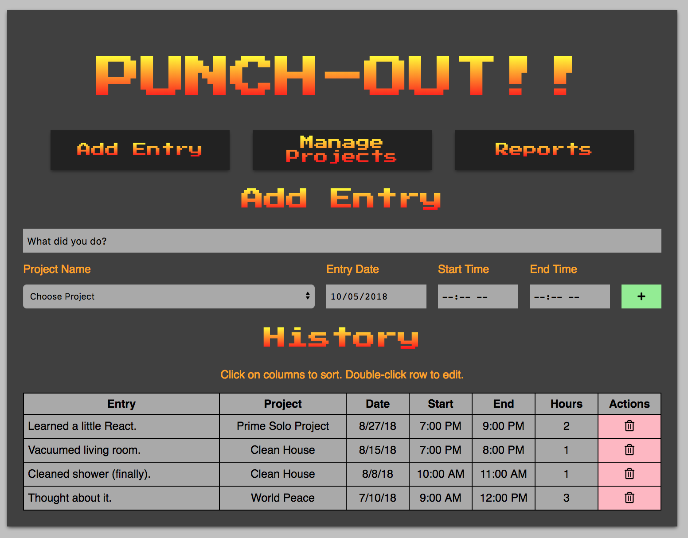
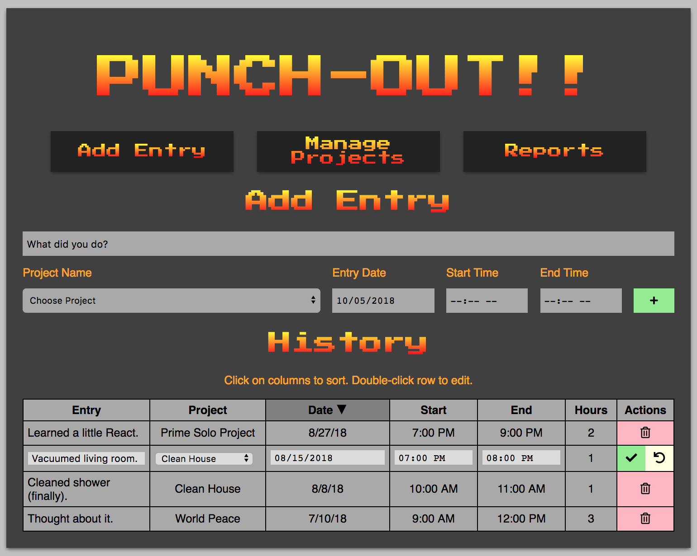
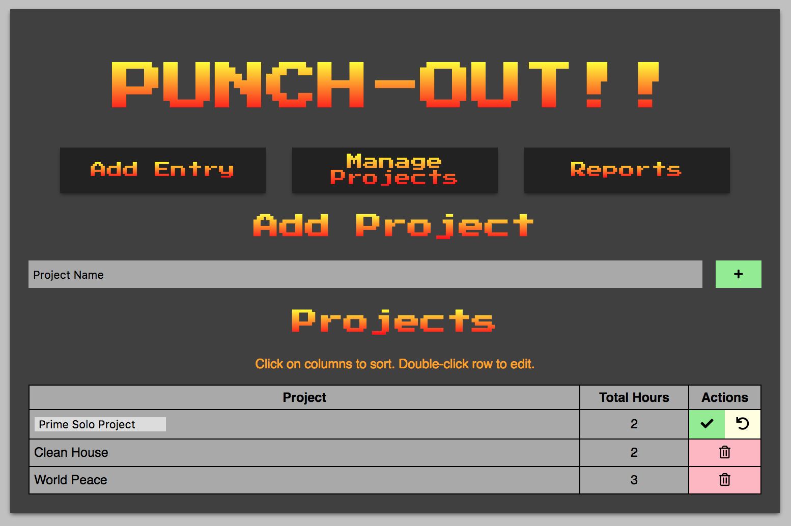
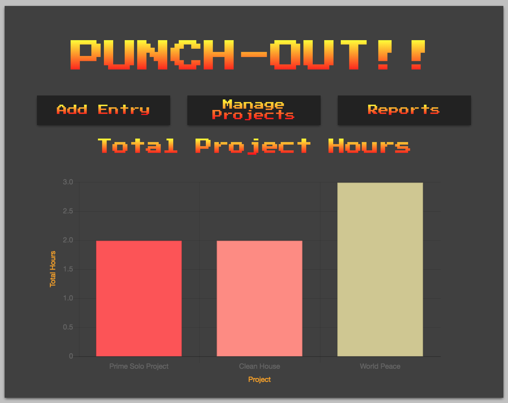

# Punch Out

The fifth weekend project at Prime Digital Academy was a larger, extended project for which we were given two days of in-class time, as well as the weekend, to work on it. Out of three choices for projects, I chose a project time tracker application.

In this app, you are able to add a time entry for a project, including the date, start time, and end time. All entries are displayed in a table. A similar page exists for managing projects, where you may add or delete a project. Deleting a project also deletes all of that project's associated time entries. The table on the projects page displays the total hours worked on that project (sum of hours for all entries for that project).

## Built With

AngularJS, Node, Express, PosgreSQL, ChartJS

## Installation/Setup

If you would like to setup this project on your local machine, first clone this repository:
```bash
mkdir punch_out
cd punch_out
git clone https://github.com/pheggeseth/Punch-Out
npm install
```

You will then need to set up the database in PostgreSQL. If you don't have PostgreSQL installed on your machine, you will need to that first. If you are using a Mac, I recommend installing PostgreSQL with [Homebrew](https://brew.sh/) via the terminal.

To set up the database, you will need to create a database called "time_tracker" (I recommend using a program like [Postico](https://eggerapps.at/postico/)) run the SQL commands in the [database_setup.sql](database_setup.sql) file in the root directory of this project. This will create all of the necessary tables and fill the item and category tables with data.

After the database is set up, you can start the project by running `npm start` from the terminal.

## Application Walkthrough

The primary view is where the user may enter timesheet entries and attribute them to a specific project.



The user enters in a description of what they did, chooses the name of the appropriate project, the date, as well as the start and end time.

The user may also sort existing entries by any columns by clicking on the column heading, clicking again to toggle between sorting ascending or descending. Double-clicking on a row in the entry history table makes it possible to edit that particular entry, in which case the delete button for that row is replaced by an undo and confirm button. Clicking undo abandons the changes, while clicking save saves the changes to the row.



Clicking on "Manage Projects" brings the user to the projects view.



This view has similar functionality to the entries view in terms of being able to add a project, edit an existing project, or sort projects by column.

The reports view shows a bar chart summarizing existing data.



## Authors

* Paul Heggeseth
